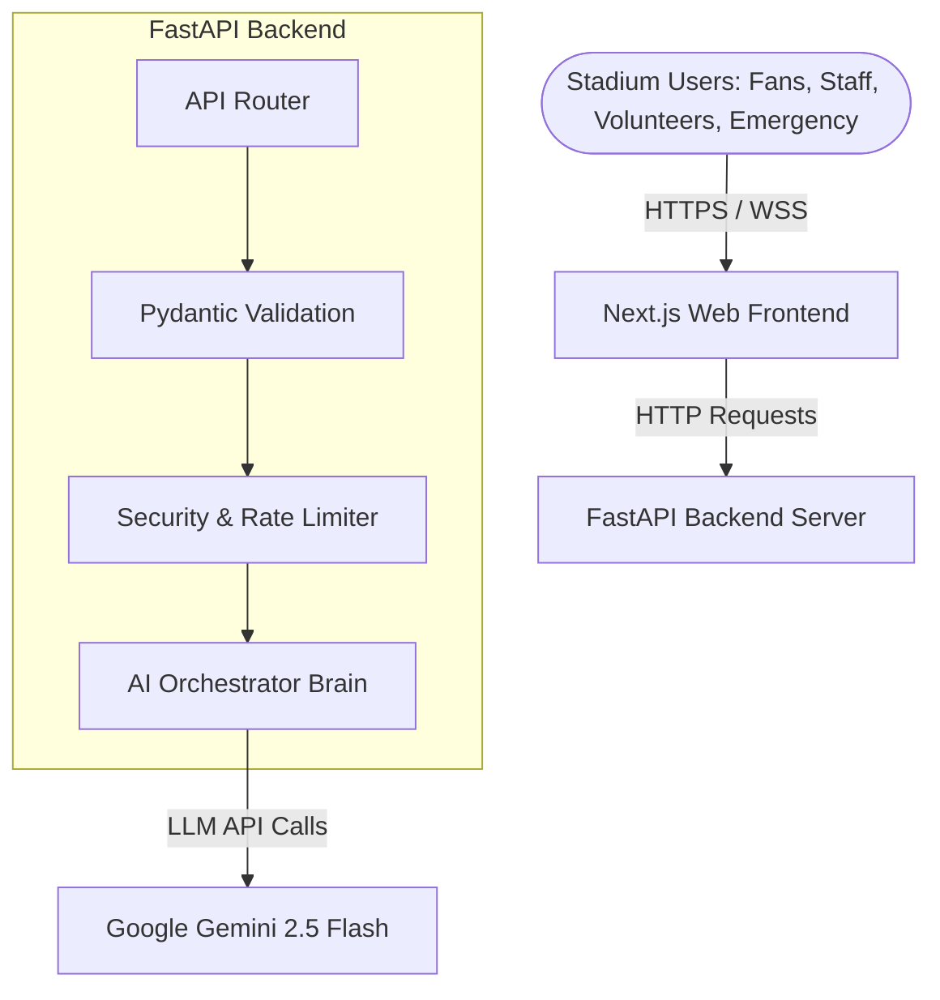

# StadiumMind AI 🧠

### *The AI Operating System for FIFA World Cup 2026 Stadium Operations.*

---

## 🏆 Challenge Submission Details 

### 1. Chosen Vertical

* **Smart Stadiums & Tournament Operations**: A GenAI-enabled solution that enhances stadium operations and the overall tournament experience for fans, organizers, volunteers, and venue staff during the **FIFA World Cup 2026**.

### 2. Approach & Logic

* **Compulsory Generative AI Integration**: The solution explicitly leverages Generative AI (Google Gemini 2.5 Flash via `google-genai` SDK) to improve:
  - **Navigation & Accessibility**: AI-driven accessible route planning for wheelchairs/elevators.
  - **Crowd Management & Transportation**: Predictive flow AI modeling to ease gate congestion and coordinate metro transit.
  - **Sustainability**: Real-time AI forecasting for power, water, and waste load tracking.
  - **Multilingual Assistance**: Transcription and AI translation mapping for international fans.
  - **Operational Intelligence & Real-Time Decision Support**: AI orchestrator that triggers coordinated multi-step action plans for emergency responses and incident summaries.
* **Dynamic Telemetry Integration**: Rather than static mocks, the system makes live network requests (e.g., weather data from **Open-Meteo API** matching FIFA World Cup 2026 venue coordinates) and updates parameters dynamically using a state-progression clock logic.
* **Offline Fallbacks**: Includes a secure local fallback mechanism that serves fully-formed mock intelligence outputs in case the `GEMINI_API_KEY` is not present, ensuring the app remains fully usable under local offline evaluation.

### 3. How the Solution Works

1. **Ingestion & Validation**: Inputs (like voice query transcripts or incident forms) pass through strict Pydantic schema validation and sanitation rules to isolate malicious command sequences.
2. **AI Command Decider**: The engine analyzes reports, generates location extractions, risk ratings, ETAs, and suggests pathfinder routes.
3. **Real-Time Dashboard & Digital Twin**: The user interface streams operations to a live light-theme control panel showing an interactive SVG-based stadium layout, live incident logs, and approval switches.

### 4. Assumptions Made

* *Stadium Location*: Target venue coordinates are configured around SoFi Stadium (latitude `33.9534`, longitude `-118.3392`).
* *Network Connectivity*: Backend assumes access to public APIs like Open-Meteo for real-time telemetry updates. If offline, graceful mocked telemetry fallbacks are initiated.
* *Security Key*: If `GEMINI_API_KEY` is missing, the system automatically logs a diagnostic warning and shifts to offline reasoning logic rather than crashing.

---

StadiumMind AI is an intelligent stadium operations system coordinating fans, volunteers, police, emergency responders, transit networks, and stadium organizers. Instead of addressing a single siloed problem, StadiumMind AI functions as a central brain that mitigates crowd congestion, automates dispatch pathways during medical alerts, coordinates sustainability outputs, and streamlines post-incident logging.

---

## 🛠️ Tech Stack

* **Frontend:** Next.js (App Router), Tailwind CSS (Glassmorphic dark UI), Framer Motion (Micro-animations)
* **Backend:** FastAPI (Python), Google Gemini 2.5 Flash API (AI Decision Engine & parsing)
* **Orchestration & Typing:** Pydantic validation (Input sanitation), Starlette
* **Testing:** Pytest, FastAPI TestClient
* **Speech Integration:** Web Speech API (Instant client-side voice transcription)
* **CI/CD:** GitHub Actions (Automated linting, building, and pytest checks)

---

## 🏗️ System Architecture



---

## 🚀 Key Features

1. **Crowd Heatmap & Inflow Predictor:** Dynamically detects gate congestion limits and redirects traffic to alternative gates.
2. **AI Route Planner:** Computes pathways factoring in elevation, elevators, wheelchair ramps, and congested sectors.
3. **Volunteer AI Assignee:** Instantly answers questions and coordinates resources by routing volunteers to high-need zones.
4. **Resource Sustainability AI:** Forecasts food demand, electricity yield, water consumption, and trash load based on target attendance.
5. **Emergency AI Dispatch:** Sanitizes inputs, extracts exact location fields, details severity, and maps direct EMS pathways.
6. **Voice Interface Control:** Provides touchless, hands-free inputs utilizing the Web Speech API directly in the browser.
7. **AI Multi-Step Decision Engine:** Reasons across chains of events (e.g. Weather Egress -> Metro Congestion -> Signage Update).
8. **Operations Dashboard:** Beautiful dashboard metrics cards reporting Live security checks, medical units, and transit times.
9. **AI Incident Report Generator:** Generates structured records, escalation levels, and action plans from raw staff radio text logs.
10. **Sanitized Input Isolation:** Built-in protection against prompt injections, XSS vulnerabilities, and unauthorized rate-overflows.

---

## 📁 Repository Structure

```text
stadiummind-ai/
├── README.md               # Polished project instructions
├── LICENSE                 # MIT Open-Source license
├── .env.example            # Sample configuration setting
├── .gitignore              # Dependency & environment ignores
├── .editorconfig           # Editor spacing configuration
├── CONTRIBUTING.md         # Open-source contributing guidelines
├── CODE_OF_CONDUCT.md      # Rules of conduct
├── SECURITY.md             # Reporting vulnerabilities & security rules
├── CHANGELOG.md            # Semantic version history
├── docs/                   # Full system documentation
│   ├── architecture.md
│   ├── api.md
│   └── decisions.md
├── backend/                # FastAPI source folder
│   ├── main.py
│   ├── config.py
│   ├── api/
│   ├── models/
│   ├── services/
│   └── utils/
├── frontend/               # Next.js App Router source
└── tests/                  # Pytest unit tests suite
```

---

## 🚀 Getting Started

### 1. Backend Setup

```bash
# Move to the project root
python3 -m venv .venv
source .venv/bin/activate
pip install -r backend/requirements.txt

# Start the local FastAPI server
PYTHONPATH=. python3 backend/main.py
```

*The FastAPI swagger docs will be available at `http://localhost:8000/docs`.*

### 2. Frontend Setup

```bash
cd frontend
npm install
npm run dev
```

*The React Dashboard will be available at `http://localhost:3000`.*

---

## 🧪 Running Tests

```bash
# Execute the full Pytest verification suite
PYTHONPATH=. .venv/bin/pytest
```
