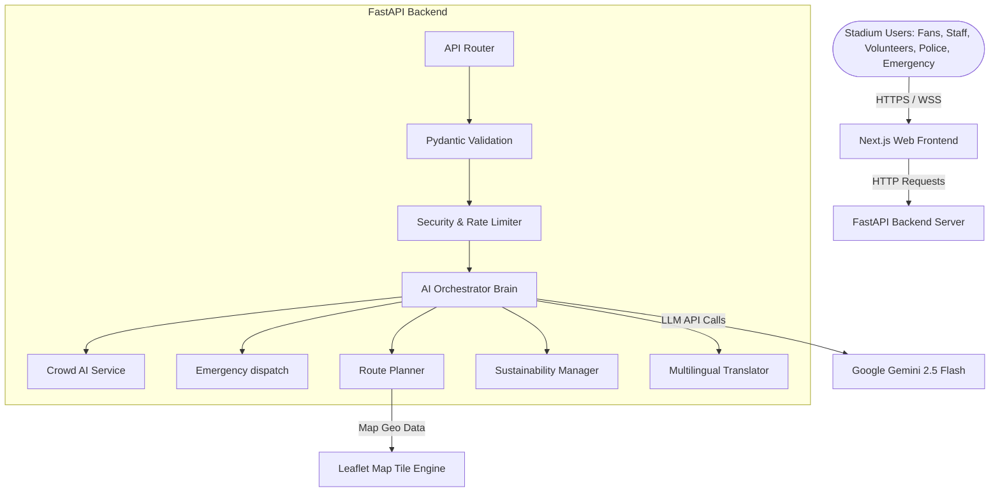

# System Architecture - StadiumMind AI

StadiumMind AI is designed as a modular, resilient, and highly performant AI-driven operating system tailored for large-scale stadium operations (specifically optimized for the FIFA World Cup 2026).

## Component Block Diagram

## Architectural Design Principles

1.  **Strict Security & Input Isolation:** No requests hit downstream business logic without Pydantic verification and rate-limiting inspection.
2.  **Modular Service Orchestration:** Each operational domain (Crowd, Emergency, Sustainability, etc.) is isolated into a standalone service package.
3.  **Real-Time Data Pipeline:** The Next.js frontend polls state updates and connects to event streams to provide real-time metrics for operations.
4.  **Resilient Speech Synthesis:** Uses the Web Speech API client-side to ensure lightweight rendering and fast voice interface responses.
